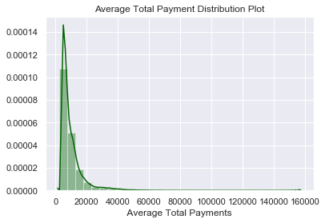
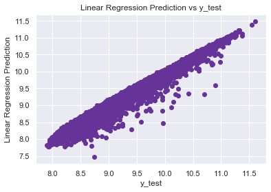
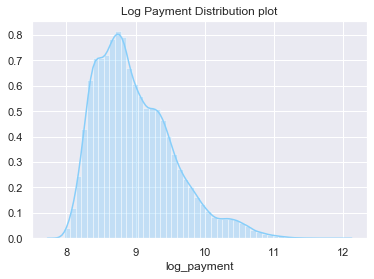

# Summary

* Wanted to predict hospital prices to see if prices would decrease
* I used Log transformation on this model to improve the data set as it had a log curve. 
* The model created an 97% training accuracy model with Linear Reegression and 99.6% training model with Random Forest. 

# EDA

